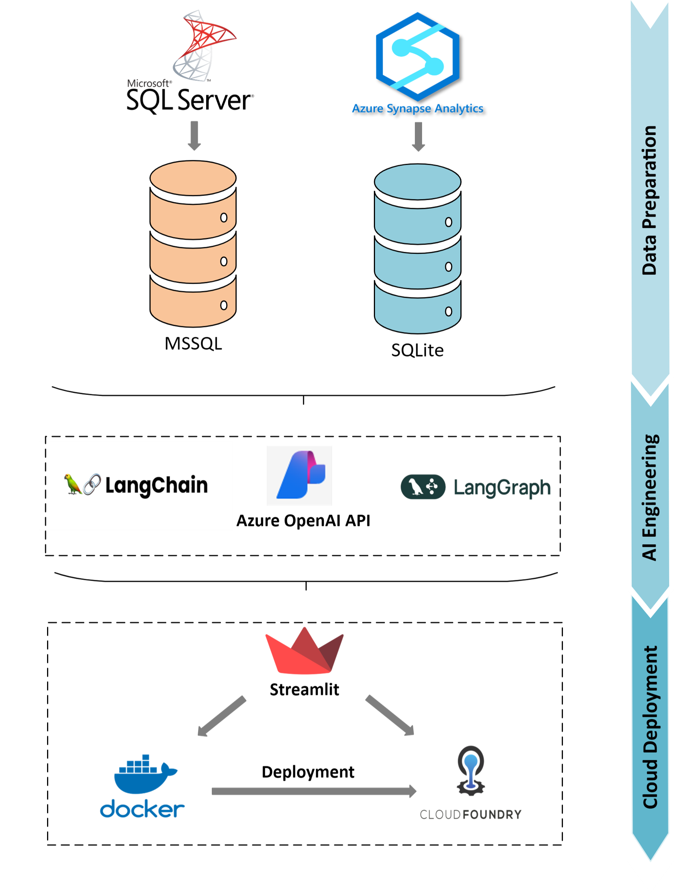

# AI-Agents
*SQL Agent - Multi-Tool Agent* with Langchain &amp; Langgraph

## Project Overview
This project was created to automate inquiries & support ad-hoc data analytics.
By accessing your SQL database, the chatbot gives accurate responses & provides the raw data in an excel file ready to download.
You can find two scripts in the repository. 
1. SQL_Chatbot_Assistant_TEMPLATE.py: simple SQL agent which tries to get data from SQL no matter the prompt
2. LangGraph_Chatbot_Assistant.py: flexible SQL agent accessing multiple data sources and able to react to simple questions, not related to SQL such as "How to use this chatbot?".

### Requirements
- Azure OpenAI API Key
- SQL database with user id & password access
- Docker & Cloud Environment (in my case: Cloud Foundry)

## Project Workflow

## How to use the template
Here I will outline how anyone can implement the solution.
Note: In this project I used Python version 3.9.23

### Adjustments Needed 

### 1. .env file
Here you need to insert your OpenAI & SQL credentials.

### 2. Chatbot Code 
#### 2.1 Database 
Here you have to adjust the database setup with your table & column names. 
Note: in my case I use MSSQL & SQLite which I created from a .parquet file, but works with any SQL database and any tabular data for SQLite. You could also connect a maintained excel file for instance. 

#### 2.2 SQLite & Sharepoint
To enable easy access to the SQLite database & ensure updates in the .db object can be reflected easily without deploying every time after updating the data, I saved the .db object on the sharepoint & setup a connection to the sharepoint via Microsoft Graph API. 
I chose this method since I could not access the data directly from python, hence the workaround. But by preparing the parquet file, I noticed this can be done for any file in tabular data.
Note: this is not necessary, you can also upload the .db object to cloud, but this will cost some MB/GB of memory.

#### 2.3 Prompt Templates
Here you need to adjust many things:
- Ensure to explain the business background and provide insider terminology used for the different tables & columns. 
- Provide a long an detailed list with special instructions like when to use which column (e.g. when you have two columns for revenue with different currencies...)
- Also tell the LLM how the tables are related and provide join instructions
- Provide *many example prompts with the correct SQL query*, especially for frequent & complex queries.
- Adjust answer prompt accordingly
Note: the "explain" chain, is merely a prompt template which provides answers to user questions dircetly (e.g., "How can i use this chatbot").

#### 2.4 Streamlit App 
Depending on your needs, you might need to adjust the design and functionality especially in the sidebar. 
If you need additional pages, just add the .py files in the pages folder. 
You might need to adjust the graph in the langgraph architecture or the chains themselves. You can create different workflows and create new features based on this template.

### 3. odbc.ini & odbcinst.ini
Also adjust your credentials here. 
This basically ensures the SQL driver installation in the container runs smoothly.
If the your driver is different, adjust.

### 4. Docker-compose yaml 
Only needed to adjust the name of the Docker Image.

### 5. Dockerfile
If your driver is different, adjust driver installation and change the file name at the end to match your streamlit app file name.

### 6. manifest.yaml (OPTIONAL: Cloud Foundry)
Adjust again all the credentials and add the Docker image registry link.

### 7. config.yaml (OPTIONAL: streamlit authentication)

Adjust to set your user & password

